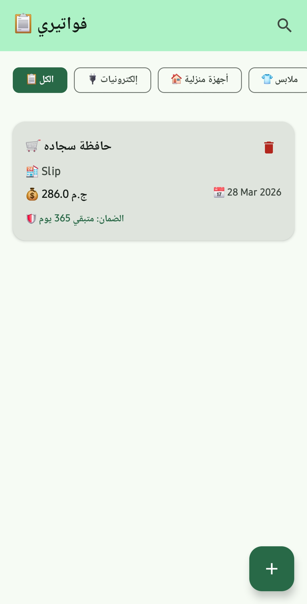
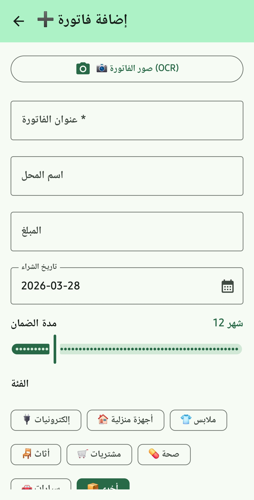
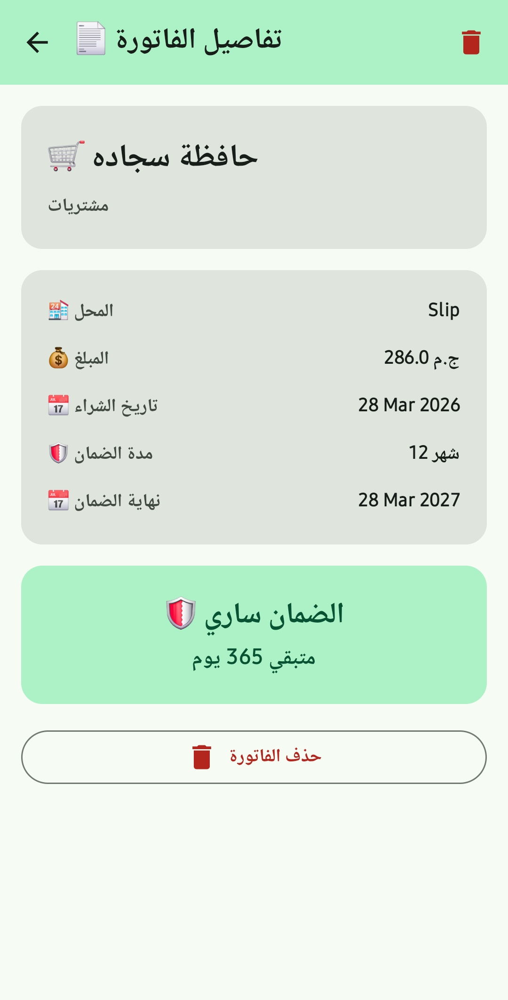
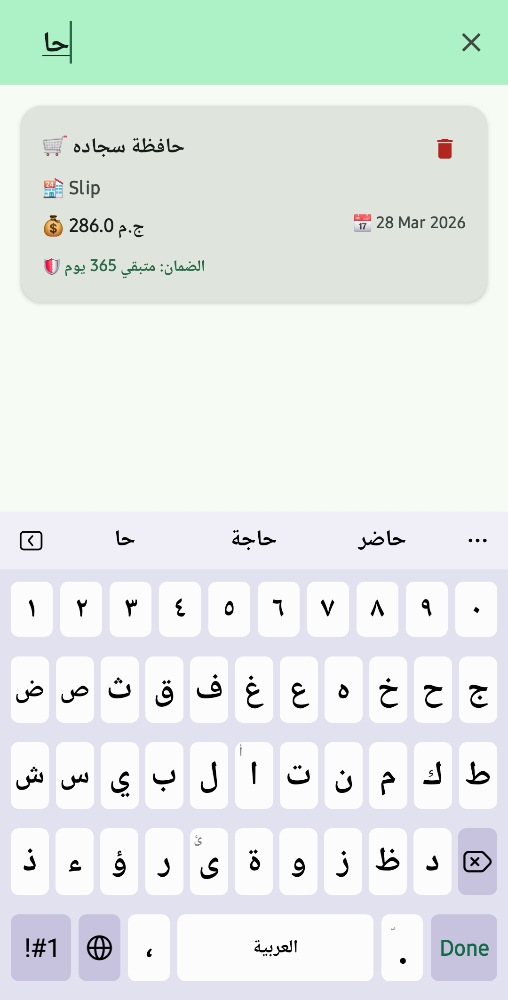
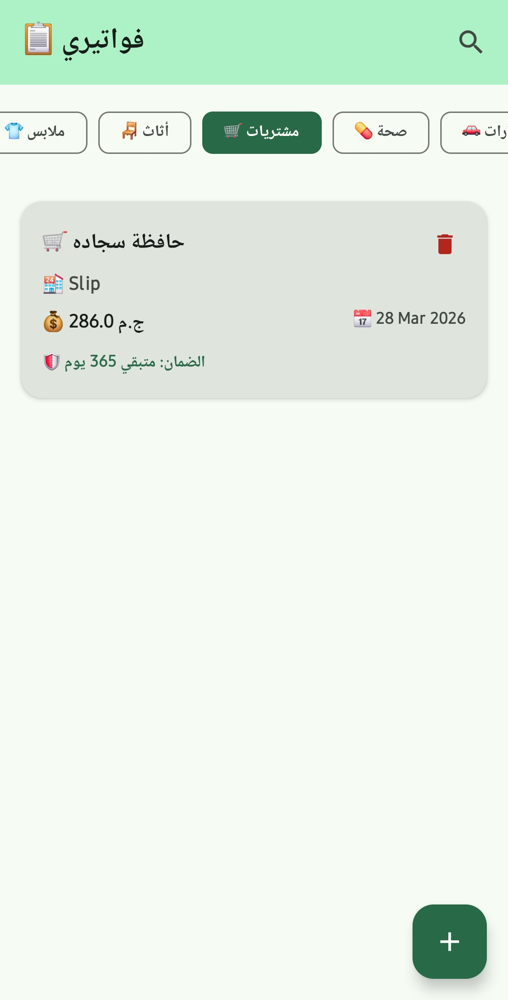

# 🧾 Receipt Tracker

A smart Android application that helps you organize and track your purchase receipts
and warranties. Never lose a warranty again!

تطبيق أندرويد ذكي بيساعدك تنظم وتتابع فواتير مشترياتك والضمانات.
مش هتضيع ضمان تاني!

---

## 📱 Screenshots

<p align="center">
  
  
  
</p>

<p align="center">
  
  
  
</p>

---

## ✨ Features

### 📷 Smart Receipt Scanning (OCR)
- Capture receipt photos using device camera
- Automatically extract **amount**, **date**, and **store name** using ML Kit
- Support for multiple date and currency formats

### 🗂️ Receipt Management
- Add, edit, and delete receipts
- Categorize receipts (Electronics, Home Appliances, Clothing, etc.)
- Search receipts by title, store name, or notes
- Filter by category

### 🛡️ Warranty Tracking
- Set warranty period for each receipt (1-60 months)
- Auto-calculate warranty expiry date
- Visual warranty status indicator (Active / Expiring Soon / Expired)

### 🔔 Smart Notifications
- Daily background check for expiring warranties
- Get notified 30 days before warranty expires
- Never miss a warranty claim again

### ☁️ Cloud Storage
- All data synced to Supabase cloud
- Receipt images stored in Supabase Storage
- Access your receipts from anywhere

---

## 🏗️ Architecture

The app follows **Clean Architecture** with **MVVM** pattern:
┌─────────────────────────────────────────┐
│ Presentation Layer │
│ ┌─────────────┐ ┌─────────────────┐ │
│ │ Screens │ │ ViewModels │ │
│ │ (Compose) │ │ (StateFlow) │ │
│ └─────────────┘ └─────────────────┘ │
├─────────────────────────────────────────┤
│ Domain Layer │
│ ┌─────────────┐ ┌─────────────────┐ │
│ │ Use Cases │ │ Repository │ │
│ │ │ │ Interface │ │
│ └─────────────┘ └─────────────────┘ │
├─────────────────────────────────────────┤
│ Data Layer │
│ ┌─────────────┐ ┌─────────────────┐ │
│ │ Repository │ │ Supabase │ │
│ │ Impl │ │ Client │ │
│ └─────────────┘ └─────────────────┘ │
└─────────────────────────────────────────┘

---

## 🛠️ Tech Stack

| Technology | Usage |
|---|---|
| **Kotlin** | Programming Language |
| **Jetpack Compose** | Modern UI Toolkit |
| **Material 3** | Design System |
| **Supabase** | Backend (Database + Storage) |
| **ML Kit** | OCR Text Recognition |
| **CameraX** | Camera API |
| **Hilt** | Dependency Injection |
| **Navigation Compose** | Screen Navigation |
| **WorkManager** | Background Warranty Checks |
| **Coil 3** | Image Loading |
| **Kotlin Coroutines** | Asynchronous Programming |
| **StateFlow** | Reactive State Management |

---

## 📂 Project Structure
📁 receipttracker/
│
├── 📁 di/ # Dependency Injection
│ └── AppModule.kt
│
├── 📁 data/
│ ├── 📁 model/
│ │ ├── ReceiptDto.kt # Data Transfer Object
│ │ └── ReceiptMapper.kt # DTO ↔ Domain Mapper
│ ├── 📁 remote/
│ │ └── SupabaseProvider.kt # Supabase Client Setup
│ └── 📁 repository/
│ └── ReceiptRepositoryImpl.kt
│
├── 📁 domain/
│ ├── 📁 model/
│ │ ├── Receipt.kt # Domain Model
│ │ └── Category.kt # Receipt Categories
│ ├── 📁 repository/
│ │ └── ReceiptRepository.kt # Repository Interface
│ └── 📁 usecase/
│ ├── AddReceiptUseCase.kt
│ ├── GetReceiptsUseCase.kt
│ ├── DeleteReceiptUseCase.kt
│ ├── SearchReceiptsUseCase.kt
│ └── UploadImageUseCase.kt
│
├── 📁 presentation/
│ ├── 📁 home/
│ │ ├── HomeScreen.kt
│ │ └── HomeViewModel.kt
│ ├── 📁 add_receipt/
│ │ ├── AddReceiptScreen.kt
│ │ └── AddReceiptViewModel.kt
│ ├── 📁 receipt_detail/
│ │ ├── DetailScreen.kt
│ │ └── DetailViewModel.kt
│ ├── 📁 camera/
│ │ └── CameraScreen.kt
│ └── 📁 components/
│ ├── ReceiptCard.kt
│ ├── CategoryChip.kt
│ └── EmptyState.kt
│
├── 📁 navigation/
│ ├── Screen.kt
│ └── NavGraph.kt
│
├── 📁 notification/
│ ├── WarrantyWorker.kt
│ └── NotificationHelper.kt
│
├── 📁 util/
│ ├── TextRecognitionHelper.kt # OCR Processing
│ └── DateUtils.kt # Date Calculations
│
├── MainActivity.kt
└── ReceiptApp.kt # Application Class

---

## 🚀 Getting Started

### Prerequisites

- Android Studio Ladybug or later
- Minimum SDK: API 26 (Android 8.0)
- Supabase Account

### 1. Clone the Repository

```bash
git clone https://github.com/yourusername/receipt-tracker.git
cd receipt-tracker
2. Setup Supabase
Create a new project at supabase.com

Run this SQL in the SQL Editor:

SQL

CREATE TABLE receipts (
    id UUID DEFAULT gen_random_uuid() PRIMARY KEY,
    title TEXT NOT NULL,
    store_name TEXT,
    amount DECIMAL(10,2),
    purchase_date DATE NOT NULL,
    warranty_months INTEGER DEFAULT 12,
    warranty_end_date DATE,
    category TEXT DEFAULT 'other',
    image_url TEXT,
    notes TEXT,
    created_at TIMESTAMP WITH TIME ZONE DEFAULT NOW()
);
Create a Storage Bucket:

Name: receipt-images
Public: ON
Allowed MIME types: image/jpeg, image/png
Set Storage Policies:

Allow SELECT for all users
Allow INSERT for all users
3. Configure the App
Open data/remote/SupabaseProvider.kt and update:

Kotlin

object SupabaseProvider {
    val client = createSupabaseClient(
        supabaseUrl = "YOUR_SUPABASE_URL",
        supabaseKey = "YOUR_SUPABASE_ANON_KEY"
    ) {
        install(Postgrest)
        install(Storage)
    }
}
### 3. Configure API Keys

1. Open `local.properties` in the project root
2. Add your Supabase credentials:

   ```properties
   SUPABASE_URL=https://your-project-id.supabase.co
   SUPABASE_KEY=your-supabase-anon-key
4. Build & Run
Bash

# Open in Android Studio and run on device/emulator
# OR
./gradlew assembleDebug
🔑 Key Implementation Details
OCR Text Extraction
Kotlin

// Extracts amount using multiple regex patterns
// Supports: "Total: 500.00", "500.00 EGP", "ج.م 500.00"
TextRecognitionHelper.extractAmount(text)

// Extracts date in various formats
// Supports: "2024-01-15", "15/01/2024", "01-15-2024"
TextRecognitionHelper.extractDate(text)

// Extracts store name from first meaningful line
TextRecognitionHelper.extractStoreName(text)
Warranty Monitoring
Kotlin

// WorkManager runs daily to check warranties
// Notifies user 30 days before expiry
PeriodicWorkRequestBuilder<WarrantyWorker>(
    repeatInterval = 1,
    repeatIntervalTimeUnit = TimeUnit.DAYS
)
Clean Architecture Flow
text

User Action → Screen → ViewModel → UseCase → Repository → Supabase
                ↑                                            │
                └────────── StateFlow (UI State) ←───────────┘
📦 Dependencies
Kotlin

// Core
androidx.core:core-ktx:1.16.0
androidx.lifecycle:lifecycle-runtime-ktx:2.9.0

// Compose + Material 3
androidx.compose:compose-bom:2025.05.01
androidx.compose.material3:material3

// Navigation
androidx.navigation:navigation-compose:2.9.0

// Dependency Injection
com.google.dagger:hilt-android:2.56.2
androidx.hilt:hilt-navigation-compose:1.2.0

// Backend
io.github.jan-tennert.supabase:bom:3.1.4
io.github.jan-tennert.supabase:postgrest-kt
io.github.jan-tennert.supabase:storage-kt

// ML & Camera
com.google.mlkit:text-recognition:16.0.1
androidx.camera:camera-core:1.5.0
androidx.camera:camera-camera2:1.5.0

// Background Processing
androidx.work:work-runtime-ktx:2.10.1
androidx.hilt:hilt-work:1.2.0

// Image Loading
io.coil-kt.coil3:coil-compose:3.2.0

// Serialization
org.jetbrains.kotlinx:kotlinx-serialization-json:1.8.1
🤝 Contributing
Fork the repository
Create your feature branch (git checkout -b feature/amazing-feature)
Commit your changes (git commit -m 'Add amazing feature')
Push to the branch (git push origin feature/amazing-feature)
Open a Pull Request
📄 License
This project is licensed under the MIT License - see the LICENSE file for details.

text

MIT License

Copyright (c) 2025 Your Name

Permission is hereby granted, free of charge, to any person obtaining a copy
of this software and associated documentation files (the "Software"), to deal
in the Software without restriction, including without limitation the rights
to use, copy, modify, merge, publish, distribute, sublicense, and/or sell
copies of the Software, and to permit persons to whom the Software is
furnished to do so, subject to the following conditions:

The above copyright notice and this permission notice shall be included in all
copies or substantial portions of the Software.

THE SOFTWARE IS PROVIDED "AS IS", WITHOUT WARRANTY OF ANY KIND, EXPRESS OR
IMPLIED, INCLUDING BUT NOT LIMITED TO THE WARRANTIES OF MERCHANTABILITY,
FITNESS FOR A PARTICULAR PURPOSE AND NONINFRINGEMENT.
👤 Author
Your Name

GitHub: @mohamed-mahdy-7
LinkedIn: Mohamed Mahdy
Email: mohamedmorsy.info@gmail.com
⭐ Show Your Support
Give a ⭐ if you found this project useful!
